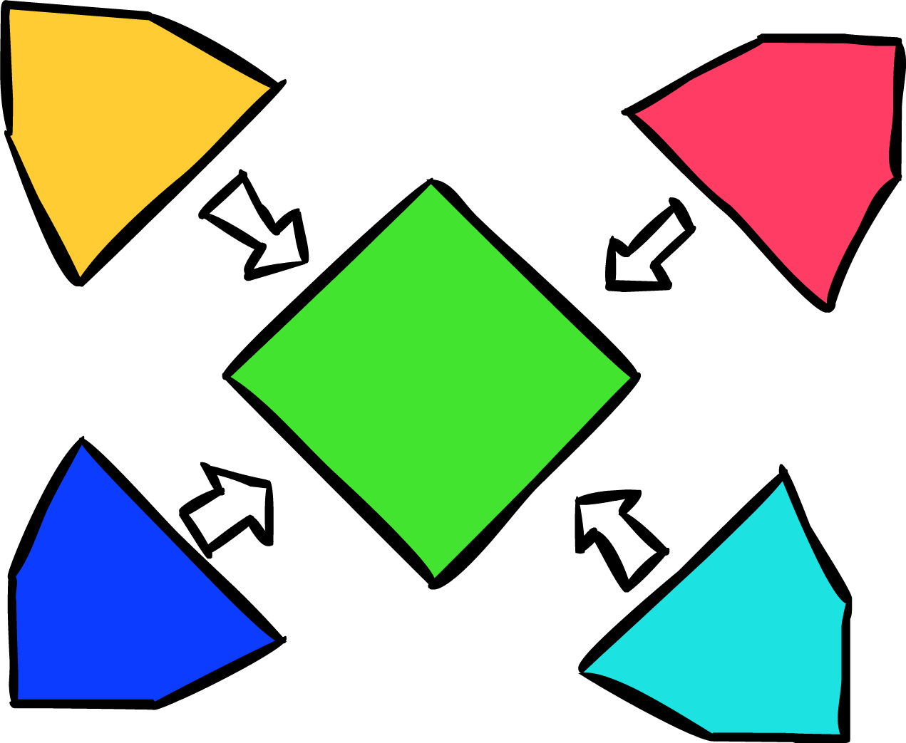

# FlxAnimate
A way to introduce texture atlases through your flixel projects.

FlxAnimate introduces a way to add single animations through the texture atlas from the Adobe Animate, making the animations be more modifiable through the png so instead of the whole animation stamped in sheets, it's a recap of all the drawings which will be used for the animation later on.
Right now it's in development, so it's very possible the name functions, variables and/or classes will change on the future.
### WARNING!
Currently, FlxAnimate supports:
  - Graphics
  - Optimised Texture Atlas
  - SpriteMaps of 1 image file
If you use MovieClips or Buttons, an unoptimised version of the atlas or spritemaps of more than one spritemap, It won't work. also that it's kinda fucky on some symbols for some reason, pls check this as a pre-pre-alpha.
## Version which is supported
The Animate version which is tested and supported is 21, We actually don't know if it works on another versions so if you don't have that version, Please check if it works on your texture atlas, if it doesn't open an issue remarking what's the issue and the Adobe Animate that you use.

# Support
You don't have to do it, but if you feel like you want to support this repo, Please check my Discord Miss Muffin#8930 And send an issue of what's it's giving you problems
